## Objetivo

Nessa seção vamos por em prática o uso dos Formflows aplicando os seus conceitos e ferramentas para implementar o exemplo da introdução visto na [Visão Geral](/orgs/byndcloud/forms/formflows/).

!!! example "Mais exemplos"
     Caso você deseje ver mais exemplos e ter mais ideias do que pode ser feito com os Formflows acesse a [antiga documentação](https://beyondco.notion.site/Exemplos-207c19723bcf479fb9ececd77094a5b6).

Sendo assim desejamos alcançar os seguintes fluxos:

- Iniciar com campos ocultos

``` mermaid
graph LR
  A[Start] --> B{Formulário aberto};
  B --> C(Oculta);
  C --> D[CPF];;
  C --> E[CNPJ];
  C --> F[Nome da empresa];
  C --> G[Nome Fantasia];
  C --> H[Endereço];
```

- Exibir CPF ou CNPJ

- Busca e preenchimento de campos com dados da empresa

``` mermaid
graph LR
  A[Start] --> B{CNPJ Válido?};
  B -->|Verdadeiro| C[Exibe Popup];
  C --> D[Chamada a API];
  D --> E[Exibe e preenche Nome da empresa];
  E --> F[Exibe e preenche Nome Fantasia]; 
  F --> G[Exibe e preenche Nome Fantasia];
  G --> H[Oculta Popup];
  H --> B;
  B -->|Falso| Z[Não executa ação];
  Z --> B;
```

## Implementação

### Configuração inicial
Primeiramente temos que criar um formulário, para isso utilizaremos os [Quoti Databases](/orgs/byndcloud/quoti-databases/).

Acesse a página que lista todos os bancos de dados em /databases.

Então crie um novo database para armazenar as respostas do seu formulário de fornecedores.

Clique em continuar e configure seu formulário com todos os campos necessários. Nesse caso vamos precisar dos seguintes campos:

- Nome: nome do fornecedor, campo de resposta curta;
- Tipo de pessoa: múltipla escolha com opção "Pessoa física" ou "Pessoa jurídica";
- CPF\: campo do tipo CPF;
- CNPJ\: campo do tipo CNPJ;
- Nome da empresa: campo de resposta curta;
- Nome Fantasia: campo de resposta curta;
- Endereço: campo de resposta curta;

Todos os campos devem ser obrigatórios e para simplificar posteriormente, copie e cole o campo "Título" para "Nome da variável" conforme nas imagens abaixo.

Clique para salvar a base de dados. Atualize a página, procure pela base de dados que você acabou de criar e clique para gerenciá-la.

Então clique na opção para editar Formflow daquele formulário. Você será redirecionado para o Formflow Builder!

### Fluxo 1 - Iniciar com campos ocultos
Nosso primeiro fluxo consiste em ocultar os campos que não queremos que sejam exibidos assim que nosso fornecedor abrir o formulário. São eles:

- CPF
- CNPJ
- Nome da empresa
- Nome fantasia
- Endereço

Para isso vamos nomear esse nosso fluxo de "Inicia campos ocultos". Abaixo nomearemos o primeiro nó de "Formulário aberto" com o mesmo tipo. E então adicionamos um nó com nome "Oculta campos".

Esse campo deve ser do tipo que realiza modificações em propriedades de um campo. Em seguida selecione quais campos que desejamos alterar as propriedades. Em seguida adicione uma ação.

Configure para a ação ser do tipo que modifica a visibilidade, selecione seu valor para oculto.
Salve o Formflow para checarmos se nossas alterações funcionaram!
Acesse novamente a página que lista todos os bancos de dados em /databases e procure pelo database criado por você. Então clique para adicionar um novo individualmente.

O formulário possui apenas os campos de Nome e Tipo de Pessoa 🎉

Com isso nosso fluxo 1 ficou com essa cara:

### Fluxo 2 - Exibir CPF ou CNPJ
Para esse fluxo queremos exibir/ocultar os campos CPF/CNPJ com base na resposta do campo anterior de Tipo de pessoa. Para isso vamos criar um novo fluxo e batizá-lo de "Oculta/Exibe CPF/CNPJ" e dessa vez o nosso tipo de nó será o que observa por modificações em um campo do formulário. O campo será o "Tipo_de_pessoa".

Em seguida adicione um novo nó do tipo que verifica condições e adicione uma ação para verificar se o valor é igual a algo. No valor, escreva qual valor você deseja que o campo seja para ir para o fluxo de verdadeiro, caso contrário ele irá pra falso. No exemplo queremos saber se o campo Tipo de Pessoa tem o valor "Pessoa física" ou não.

Para ambos os casos verdadeiro ou falso escolhemos o tipo do nó que realiza modificações em uma propriedade de um campo e selecionamos o campo de CPF.
Em seguida adicionamos uma nova ação para o caso verdadeiro, sua ação deve ser do tipo que modifica a visibilidade e seu valor deve ser para exibir. Para o caso falso fazemos o mesmo, apenas mudando que ao inves de exibir, vamos ocultar.

Por fim adicionamos mais um nó para ambos os casos verdadeiro e falso do tipo que realiza modificações em propriedades de um campo, selecionando agora o campo CNPJ. Para o caso verdadeiro, criamos uma nova ação que modifica a visibilidade, dessa vez com valor para Ocultar. No caso falso a mesma abordagem, modificando apenas o valor para exibir.

Salve e teste!

Com isso nosso fluxo 2 ficou com essa cara:

### Fluxo 3 - Busca e preenchimento de campos com dados da empresa
Vamos criar um novo fluxo dessa vez com o nome "Carrega dados da empresa". Para esse vamos querer que o primeiro nó seja o que observa por modificações em um campo. O campo observado será **CNPJ**. Então adicionamos um nó que verifica condições igual o fluxo anterior, porém a ação adicionada é do tipo **Expressão**. Esse tipo de ação permite que você escreva condicionais mais complexas que apenas uma comparação de igualdade.
Também é necessário adicionar o **Debounce de 1000ms** para que a verificação não seja feita toda vez que for preenchido um caractere no campo.

Para buscarmos pelas informações da empresa precisamos que o CNPJ esteja preenchido corretamente, utilizando a condição `$field.CNPJ.response.length === 18`.

Iremos fazer uma chamada à API que não é imediata, para isso existe um tipo de nó / ação para exibirmos um Popup de carregamento para o usuário. Basta escolher o tipo de nó de **controle de Popup** e escolher o tipo como **loading**. Lembre-se de colocar para **Exibir** conforme abaixo:

Uma vez exibindo o carregamento, executamos a chamada à API. Adicione um novo no do tipo de **Chamar uma API ou Endpoint**.

O endpoint chamado será `https://publica.cnpj.ws/cnpj/{cnpj}`. O `cnpj` precisa estar no formato apenas de números. Se você reparar `$field.CNPJ.response` está mascarado, logo precisamos apenas dos números.

No campo da URL do webhook, assim como em todos os outros campos com essa aparência, é possível utilizar expressões javascript. Para utilizálos basta escrever `{{ double_keys_open }} (seu código) {{double_keys_close}}`.

Obs.: Na ação de expressão não é necessário a utilização das chaves duplas visto que já é convertido para Javascript automaticamente.

Fazemos: `https://publica.cnpj.ws/cnpj/{{ double_keys_open }}  String($field.CNPJ.response).replace(/\D/g, "") {{ double_keys_close }} `

Os próximos nós deverão usar o retorno dessa chamada para exibir e preencher programaticamente os campos da empresa. Para isso temos a variável `$output`, onde podemos acessar:

- Nome da empresa: `{{ double_keys_open }} $output.razao_social {{ double_keys_close }}`

- Nome Fantasia: `{{ double_keys_open }} $output.estabelecimento.nome_fantasia {{ double_keys_close }}`

- Endereço: `{{ double_keys_open }} $output.estabelecimento.tipo_logradouro {{ double_keys_close }} {{ double_keys_open }} $output.estabelecimento.logradouro {{ double_keys_close }} {{ double_keys_open }} $output.estabelecimento.numero {{ double_keys_close }}, {{ double_keys_open }} $output.estabelecimento.cidade.nome {{ double_keys_close }} - {{ double_keys_open }} $output.estabelecimento.estado.sigla {{ double_keys_close }}`

Primeiro vamos fazer para **Nome_da_empresa**.
Criamos um nó que modifica propriedades de um campo, então adicionamos a primeira ação para exibir e a segunda para atribuir o valor a ele:

Em seguida repetimos o processo para os campos de **Nome Fantasia** e **Endereço**.

Por fim, falta apenas ocultarmos o Popup de carregamento que havíamos aberto anteriormente:

E assim temos o resultado final:

